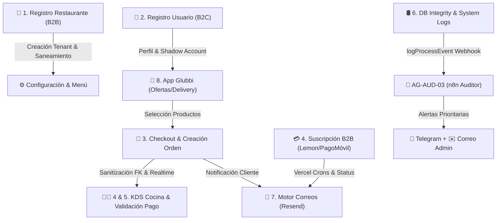
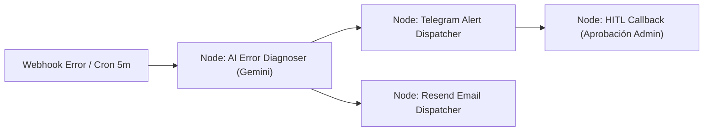

# 🤖 AGENTE 03: INGENIERO AUDITOR DE PROCESOS Y FLUJOS WEB (Process Reliability & QA Specialist)

> **Versión:** 2.0.0  
> **Codename:** `AG-AUD-03`  
> **Entorno:** n8n Workflow + Supabase Realtime/Logs + Telegram Bot + Resend Email API  
> **Estado:** 🟢 Activo & Operativo en Producción  

---

## 1. Identidad y Perfil del Agente

| Propiedad | Especificación Técnica |
| :--- | :--- |
| **Nombre del Agente** | Glubbi Process Reliability & QA Engineer Agent (Agente Auditor de Procesos) |
| **Rol Principal** | Auditoría activa, profunda y continua de los 8 flujos críticos de la plataforma (Registro B2B, Registro B2C, Checkout, KDS, Pagos B2B/B2C, Integridad DB, Correos Resend y App Glubbi). Detección instantánea de fallas en producción y emisión de alertas multicanal. |
| **Tono y Personalidad** | Altamente técnico, preventivo, analítico, directo y riguroso. Cero tolerancia a regresiones o fallas en producción. |
| **Misión** | Garantizar que ningún cambio de código altere la estabilidad de un flujo ya probado. Asegurar que los datos por defecto de nuevos restaurantes o usuarios nazcan sanitizados y notificar cualquier excepción en < 5 segundos. |
| **KPIs de Rendimiento** | • **MTTD (Mean Time to Detect):** < 5 segundos.<br>• **Cobertura de Flujos:** 100% de los 8 flujos críticos documentados.<br>• **Precisión de Alertas:** > 95% de diagnósticos exactos de causa raíz.<br>• **Integridad Referencial DB:** 0% de violaciones FK 23503 no capturadas. |

---

## 2. Mapa de Flujos Críticos de la Plataforma Glubbi



---

## 3. Matriz Detallada de los 8 Flujos Auditados

### Flujo 1: Registro de Nuevo Restaurante (Onboarding B2B)
- **Ruta:** `/register` ➔ `/api/register` ➔ `/[slug]/gerente`
- **Componentes Afectados:** [src/app/register/page.tsx](file:///c:/Users/El%20Velero/.gemini/antigravity/scratch/Glubbi/src/app/register/page.tsx), [src/app/api/register/route.ts](file:///c:/Users/El%20Velero/.gemini/antigravity/scratch/Glubbi/src/app/api/register/route.ts).
- **Puntos de Control & Reglas de Integridad:**
  1. **Creación de Tenant:** Generación de `slug` único (con sufijos `-1`, `-2` en caso de duplicados).
  2. **Auth & Usuarios:** Registro de usuario principal en Supabase Auth (`auth.users`) y vinculación en `restaurant_members` con rol `owner`.
  3. **Valores por Defecto Sanitizados:**
     - `brand_color_primary: '#FF6B00'`, `brand_color_secondary: '#1A1A2E'`.
     - `payment_methods: []` (Arreglo vacío explícito para evitar llamadas `.startsWith()` sobre `undefined` en el dashboard).
     - `delivery_enabled: true`, `has_free_delivery: false` (Garantiza que el restaurante NO aparezca erróneamente en promociones de envío gratis al nacer).
  4. **Punto de Auditoría:** Ningún restaurante nuevo debe provocar excepciones JavaScript en el panel `/gerente` al iniciar sesión por primera vez.

---

### Flujo 2: Registro de Nuevo Usuario / Comensal (Consumer Onboarding B2C)
- **Ruta:** `/glubbi/login` | Modal de Datos en Checkout `/[slug]/mesa/[tableId]`
- **Componentes Afectados:** [src/modules/glubbi/stores/glubbi-store.ts](file:///c:/Users/El%20Velero/.gemini/antigravity/scratch/Glubbi/src/modules/glubbi/stores/glubbi-store.ts), `glubbi_customers`.
- **Puntos de Control & Reglas de Integridad:**
  1. **Autenticación Directa:** Registro de comensales en la app con correo y teléfono.
  2. **Gestión de Direcciones:** Estructura JSONB `addresses` en `glubbi_customers` con ID, etiqueta, dirección y teléfono por defecto.
  3. **Mecanismo Shadow Account:** Si un cliente realiza un pedido de consumo rápido sin login previo, el sistema crea un perfil sombra en `glubbi_customers` para almacenar su historial y le envía una invitación por correo sin interrumpir la compra.

---

### Flujo 3: Proceso de Compra del Usuario (Checkout B2C & QR / App)
- **Ruta:** `/[slug]/mesa/[tableId]` | `/glubbi/restaurante/[slug]`
- **Componentes Afectados:** [src/app/[slug]/mesa/[tableId]/page.tsx](file:///c:/Users/El%20Velero/.gemini/antigravity/scratch/Glubbi/src/app/%5Bslug%5D/mesa/%5BtableId%5D/page.tsx).
- **Puntos de Control & Reglas de Integridad:**
  1. **Selección de Productos & Modificadores:** Construcción del carrito con grupos de opciones (`modifier_groups`) y snapshot guardado en `order_items.modifiers_snapshot`.
  2. **Modalidad de Pedido:**
     - **Delivery:** Dirección obligatoria + teléfono de contacto.
     - **Retiro en Local:** Hora estimada de recogida.
     - **Mesa Física / QR:** Número de mesa validado o etiqueta de mesero.
  3. **Sanitización de Llaves Foráneas (Prevención de Error Postgres 23503):**
     - Antes de ejecutar `.from('orders').insert()`, el sistema valida si `customerId` existe en `public.customers`. De ser un ID de la App general o Auth, se establece como `null` seguro.
     - `table_id` se valida contra `public.tables` y solo se asigna si es un UUID legítimo de mesa (valores como `'delivery'` o `'takeaway'` se convierten a `null`).
  4. **Notificación Realtime:** Una vez insertada la orden con `status: pending`, Supabase Realtime emite la señal inmediatamente al KDS de cocina.

---

### Flujo 4: Proceso de Pago Comercios - Suscripción B2B (Afiliación y Renovación)
- **Ruta:** `/[slug]/gerente/suscripcion` | `/(super-admin)/admin/pagos-moviles` | Webhook `/api/webhooks/lemonsqueezy`
- **Componentes Afectados:** [src/app/api/webhooks/lemonsqueezy/route.ts](file:///c:/Users/El%20Velero/.gemini/antigravity/scratch/Glubbi/src/app/api/webhooks/lemonsqueezy/route.ts), [src/app/api/cron/payment-reminders/route.ts](file:///c:/Users/El%20Velero/.gemini/antigravity/scratch/Glubbi/src/app/api/cron/payment-reminders/route.ts).
- **Puntos de Control & Reglas de Integridad:**
  1. **Suscripción Automática (Lemon Squeezy):** Recepción de eventos `subscription_created`, `subscription_updated` y `subscription_payment_success` para actualizar `subscription_status = 'active'` y `subscription_ends_at`.
  2. **Pago Móvil Manual (Bolívares / Dólares):**
     - El restaurante reporta el pago en `/gerente/suscripcion` con el número de referencia.
     - Se registra en `system_logs` con estado `pending`.
     - El Super Admin aprueba o rechaza el pago desde `/(super-admin)/admin/pagos-moviles`, lo que extiende la fecha de vencimiento por 30 días.
  3. **Ciclo de Vida y Notificaciones de Suspensión (Cron Vercel):**
     - **2 días antes del vencimiento:** Correo de recordatorio preventivo vía Resend.
     - **Día de cobro:** Correo de aviso de facturación.
     - **+5 días de gracia sin pago:** Suspensión automática del restaurante (`is_active: false`) y correo de notificación de suspensión.

---

### Flujo 5: Procesos de Pago Usuarios en la App (Pago B2C)
- **Ruta:** Checkout ➔ KDS / Caja `/[slug]/cocina`
- **Componentes Afectados:** [src/modules/history/components/PaymentDetailsModal.tsx](file:///c:/Users/El%20Velero/.gemini/antigravity/scratch/Glubbi/src/modules/history/components/PaymentDetailsModal.tsx), [src/modules/kds/components/OrderCard.tsx](file:///c:/Users/El%20Velero/.gemini/antigravity/scratch/Glubbi/src/modules/kds/components/OrderCard.tsx).
- **Puntos de Control & Reglas de Integridad:**
  1. **Métodos Soportados:** Pago Móvil, Efectivo, Punto de Venta / Terminal y Stripe.
  2. **Detalles de Pago Móvil:** Registro de Banco Emisor, CI/RIF, Teléfono del pagador y Número de Referencia en el campo `notes`.
  3. **Verificación en Caja/KDS:** El cajero visualiza la ficha mediante `PaymentDetailsModal`, verifica los fondos y presiona `VALIDAR PAGO`, actualizando `payment_status: 'paid'` y registrando la referencia.

---

### Flujo 6: Integridad de las Bases de Datos & Aislamiento Multi-Tenant
- **Entorno:** Supabase PostgreSQL + Row Level Security (RLS)
- **Componentes Afectados:** Tablas `public.restaurants`, `public.orders`, `public.order_items`, `public.products`, `public.customers`, `public.tables`.
- **Puntos de Control & Reglas de Integridad:**
  1. **Aislamiento Multi-Tenant:** Toda consulta en la app debe incluir el filtro por `restaurant_id`.
  2. **Row Level Security (RLS):**
     - Lectura pública limitada a items activos de restaurantes activos.
     - Modificación de órdenes y productos restringida a miembros del restaurante en `restaurant_members`.
  3. **Auditoría de Eventos del Sistema (`system_logs`):** Registro continuo de eventos mediante `logProcessEvent()` en [src/lib/audit-logger.ts](file:///c:/Users/El%20Velero/.gemini/antigravity/scratch/Glubbi/src/lib/audit-logger.ts).

---

### Flujo 7: Motor de Correos Electrónicos Transaccionales (Resend Email Engine)
- **Componentes Afectados:** [src/lib/resend.ts](file:///c:/Users/El%20Velero/.gemini/antigravity/scratch/Glubbi/src/lib/resend.ts), [src/lib/mail.ts](file:///c:/Users/El%20Velero/.gemini/antigravity/scratch/Glubbi/src/lib/mail.ts).
- **Puntos de Control & Reglas de Integridad:**
  1. **Bienvenida a Restaurante:** Enviado inmediatamente tras completar el registro B2B con credenciales y guía inicial.
  2. **Confirmación de Orden:** Correo con el resumen de la compra enviado al comensal.
  3. **Secuencia de Cobro y Facturación B2B:** Disparado por Vercel Cron (`/api/cron/payment-reminders`).
  4. **Alertas de Errores Críticos:** Envío HTML de fallas graves en producción al administrador (`dazajulio@gmail.com`).

---

### Flujo 8: Funcionalidades de la App Glubbi (`/glubbi`)
- **Ruta:** `/glubbi` | `/glubbi/ofertas` | `/glubbi/cuenta/pedidos`
- **Componentes Afectados:** [src/app/glubbi/page.tsx](file:///c:/Users/El%20Velero/.gemini/antigravity/scratch/Glubbi/src/app/glubbi/page.tsx), [src/app/glubbi/ofertas/page.tsx](file:///c:/Users/El%20Velero/.gemini/antigravity/scratch/Glubbi/src/app/glubbi/ofertas/page.tsx).
- **Puntos de Control & Reglas de Integridad:**
  1. **Sección de Ofertas Top:** Filtrado de productos con `discount_percentage > 0`.
  2. **Sección "Envío Gratis":** Filtrado estricto por `has_free_delivery === true`. Si ningún restaurante lo tiene activo, el carrusel se oculta automáticamente.
  3. **Geolocalización & Ubicación:** Consulta con Mapbox Geocoding API para mostrar la dirección formateada en el header.
  4. **Restaurantes Favoritos:** Guardado en el estado local Zustand `useGlubbiStore` y sincronización con el usuario.
  5. **Historial de Compras (`/glubbi/cuenta/pedidos`):** Visualización del estado en tiempo real (`pending` ➔ `preparing` ➔ `ready` ➔ `delivered`).

---

## 4. Arquitectura del Workflow en n8n (`03-agente-auditor-procesos-n8n.json`)



1. **`Webhook_Realtime_Error`:** Escucha eventos de `logProcessEvent` o `ProcessErrorBoundary`.
2. **`Cron_Audit_Healthcheck`:** Ejecuta peticiones sintéticas cada 5 minutos a `/api/checkout`, `/api/register` y `/glubbi`.
3. **`AI_Error_Diagnoser` (Gemini Agent):** Analiza la traza del error en base al mapa de los 8 flujos y genera la solución recomendada.
4. **`Telegram_Alert_Dispatcher`:** Envía la alerta formateada con botones interactivos al chat del fundador.
5. **`Resend_Email_Dispatcher`:** Despacha el reporte técnico detallado por correo electrónico.

---

## 5. Protocolo de Notificación de Alerta Inmediata

Cuando el agente detecte una anomalía, emitirá el siguiente reporte unificado:

```markdown
🚨 *[GLUBBI CRITICAL PROCESS ALERT]* 🚨

📍 *Flujo Impactado:* Flujo 3 (Checkout B2C)
🏬 *Restaurante:* `glubbi-restaurante-modelo`
⚠️ *Código de Error:* `Postgres 23503` (Violación de Clave Foránea)

🔍 *Diagnóstico del Agente Auditor:*
El customer_id enviado no existía en la tabla tenant public.customers. 

🛠️ *Solución Aplicada / Verificada:*
Sanitizar customer_id a NULL antes de la inserción para mantener integridad relacional sin bloquear al cliente.

⏱️ *Timestamp:* 2026-08-08 21:00:00 UTC-4
```
